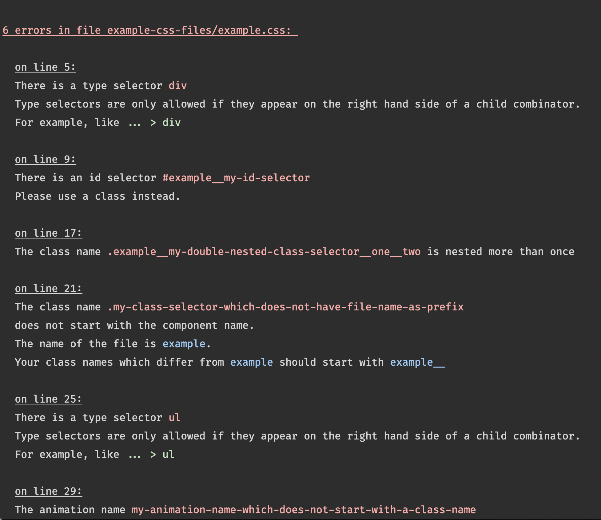

# csslint [](https://www.npmjs.com/package/@diesdasdigital/csslint)

Linter for diesdas’ [CSS architecture](https://diesdas.digital/wiki/life-as-a-developer/how-we-write-css).

### Why this architecture/a linter?
Most CSS bugs are caused by classes **unintentionally** overriding other classes. When building websites/interfaces with components this can happen for example if component styles are overwritten by a parent component. The component looks different because of where it’s placed (its context).

In any software system relying on context creates complexity. If one needs to know what the context of a specific piece of code is, one also has to understand all of that context.

CSS in JS tools solve that problem by using inline styles and/or generating class names automatically during a build step. This way developers cannot unintentionally override other components classes, because they don’t even know what the class name will be.

The downsides if CSS in JS solutions are:
- one needs a build step to generate CSS
- some tools require writing CSS in a non-standard way (as objects for example)
- while debugging class names have no meaningful names anymore

Therefore we came up with a CSS architecture which has one major and a few minor rules to get the same benefit of local reasoning for components without the drawbacks of CSS in JS tools.

### Rules it checks:

- [x] **every class name is prefixed by the component/file name**
- [x] also animation names should start with the component name, eg `@keyframes component__my-animation`
- [x] no multiple nesting in class names, eg `.component__one__two` is ill-formed
- [x] no type selectors (with the only exception `> tag`)
- [x] no id selectors

### Advantages

1️⃣ Generic knowledge

CSS syntax is a standard. Learn it once.

2️⃣ Meaningful class names

Even in production we have meaningful class names which helps when we need to debug.

3️⃣ No build step

Every browser knows how to load CSS.



## Installation

To add it to your project use `npm` or `yarn`:

```
yarn add @diesdasdigital/csslint --dev
npm install @diesdasdigital/csslint --save-dev
```

Then you can use the linter via `npx` or in `package.json` scripts:

```json
{
  "scripts": {
    "lint": "csslint 'src/**/*.css' --all"
  }
}
```

## Flags

`--all`

doesn’t stop on the first invalid file and shows a summary of how many errors it found

`--verbose`

also logs all valid files it has checked

## Ignoring errors

In your projects root folder, create `.csslintignore` file, which includes new line separate file paths which should be ignored.

Alternatively you can ignore a single line inside of a file by writing the following comment in the previous line:

```
/* csslint-disable-next-line */
```

## Collaboration

If you want to create PR, we test and develop this tool using these as a baseline:

- macOS
- [`node`](https://nodejs.org/en/) (we recommend installing it via [nvm](https://github.com/creationix/nvm))
- [`yarn`](https://yarnpkg.com)
